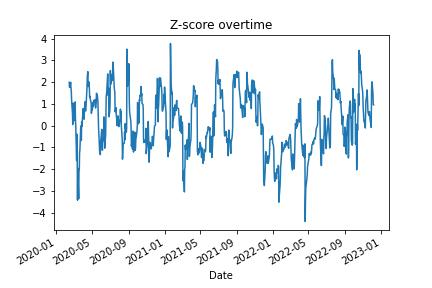
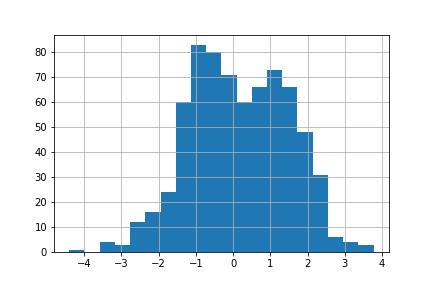
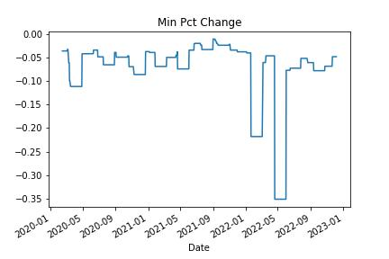
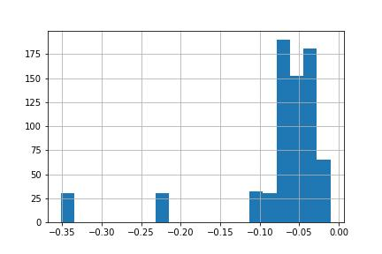

# Visualize the trend with pandas rolling statistics
## Apply rolling statistics to stock prices with pandas.

"Rolling" a statistic applies a calculation to a chunk of data, slides (or rolls) the chunk forward, and does it again. It’s how all technical analysis calculations are done.

We will go over two examples: z-score and minimum return.

Learning how to apply rolling statistics unlocks the power of pandas:

- Identify outliers
- Visualize trends
- Apply predictive measures

---

## Step 1: Import the required libraries

Pandas
matplotlib
yfinance

---

**File:** [RollingStatistics](rollingStatistics.ipynb)

---

## Step 2: Read in the Data and define the function for z-score

Use yfinance to get stock data – in this case, NFLX is used. 
(You can use any stock and any price range you want)

The z-score is the number of standard deviations a value is away from it’s mean. It’s a great way to summarize where a value lies on a distribution.

(value – average value) / standard deviation of values

This function accepts a chunk of data. Then it takes the last value from the chunk, subtracts the mean (average), and divides by the standard deviation.

The [-1] means "take the last value from the chunk"

---

## Step 3: Create the rolling statistic

Use the close price and apply the rolling function. 

The job of .rolling() is to take 30 rows (or whichever window you allocate) of data and apply the z_score function to those rows. Then move forward one row, and do it again.

**Plot the z-score over time**

**z-score histogram over time**

You can see a large negative z-score of -4.4. This is a -4.4 standard deviation move in the stock price! It corresponds to the -35% drop in NFLX on 20 April 2022.

---

## Step 4: Rolling minimum return

Look at the largest percentage drop over a rolling 30-day period.

calculate the daily percentage change on the closing price. 
Then apply the min function to the rolling window of data.

**Min Pct Change over rolling window**

**Min Pct Change Histogram over rolling window**

Looks like Netflix has had a couple of pretty bad days!
